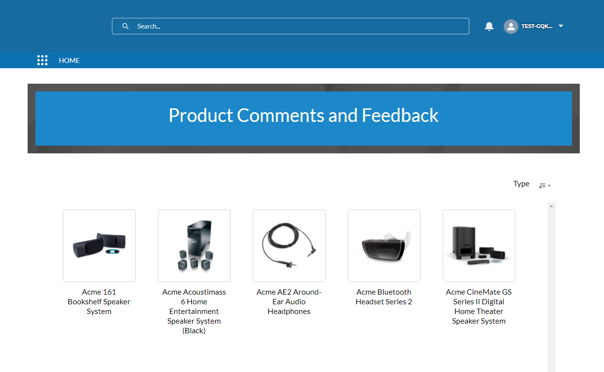
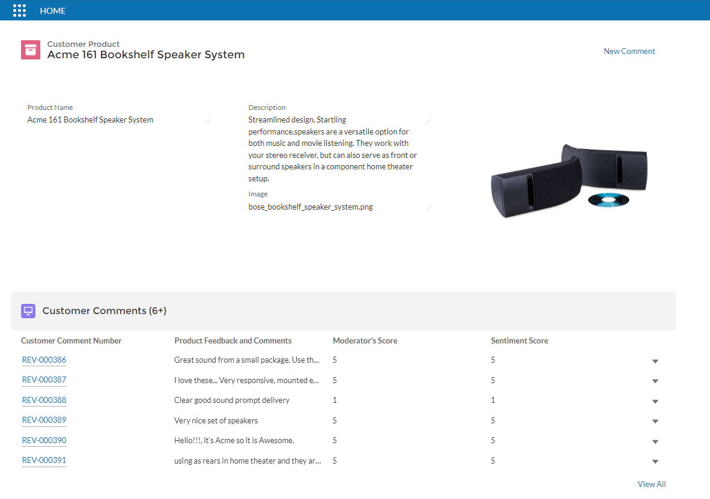

# Salesforce Functions Sentiment Demo 

### Salesforce Functions Executing a Tensorflow Sentiment Analysis Model

Salesforce Functions Executing a Tensorflow Sentiment Analysis Model

This demo is an example of running a compute heavy workload in a function. The workload is an open source, pre-trained sentiment analysis model written in JavaScript and using the [Tensorflow](https://www.tensorflow.org/js/) library. The model is the [Sentiment Analysis](https://github.com/tensorflow/tfjs-examples/tree/master/sentiment#tensorflowjs-example-sentiment-analysis) example which was trained on a set of 25,000 movie reviews from IMDB, labeled as having either positive or negative sentiment.

This Project is a Salesforce Experience Cloud Site for customers of Acme Audio, a manufacturer of speakers, headphones and other audio products. The site has product pages for customer comments and feedback. It includes a Customer Comment Custom Object that is populated with sample data from the open source, publicly available, [Amazon Product Review Dataset](https://s3.amazonaws.com/amazon-reviews-pds/readme.html).

Five Customer Product Custom Objects are created for Acme Audio, and 100 comments are imported for each product.

A Product Managers Dashboard app is included that tracks sentiment score over time by month, with drill down details for product and customer demographics.

Training data is mocked up by annotating a subset of the Amazon reviews with a machine generated Moderators Sentiment score from 1-5 that is mapped to a simple sentiment of 'Positive' (4 or 5), 'Neutral' (3) or 'Negative' (1 or 2).

When comments are imported, the AI model is invoked and a sentiment analysis performed. The sentiment score is mapped to a 'Predicted Sentiment' (1-5 score) and inserted into the Customer Comment Object for display and trend analysis.

When a new comment is submitted via the site, the text is analyzed by running the sentiment analysis model and a 'Predicted Sentiment' is calculated and added to the Object, and the dashboard is updated with the new results. 

Note that the demo shows a Product Managers' view of the 'Customer Comment' page that also shows the Sentiment and Moderators' Score in a table below the product.

The demo does not include any of the necessary AI/ML workflows for training, or other deployment and model lifecycle operations. 

Note that since the model was not trained on product review data, the sentiment predictions will not be very accurate. The Dashboard includes a scatter plot with a comparison of the 'Moderator's Sentiment' to the 'Predicted Sentiment' which would show how the model diverges from the true sentiment. However, since 'Moderator's Sentiment' was machine generated via the same model, the sentiment predictions will be perfect.